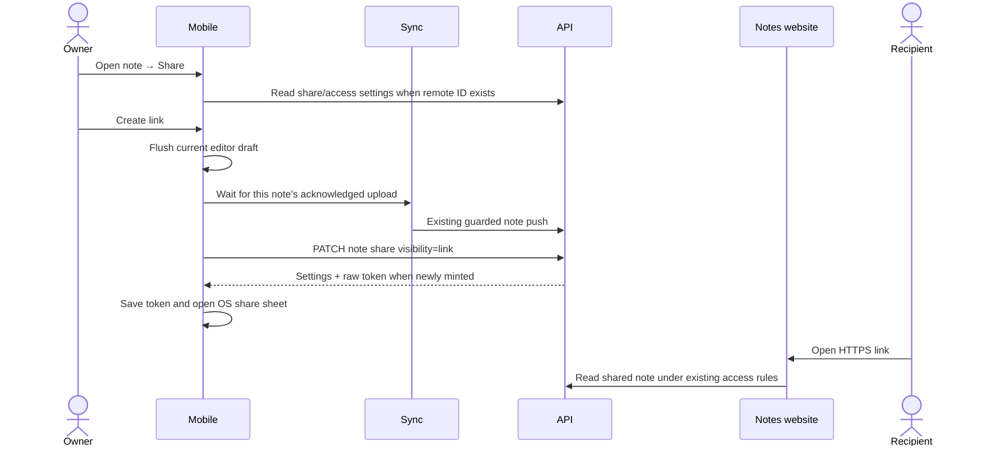

# Mobile note sharing design

Date: 2026-09-20
Status: Proposed for review; implementation has not started.

## Goal and scope

Let a mobile user open a note, choose Share, and create or manage the same web sharing experience as desktop. A recipient opens `https://notes.openwhispr.com/n/<token>` in their browser. Desktop-created and mobile-created links use the same server note and access rules.

Working assumption: the initial recipient experience stays on the notes website. An unanswered scope question was raised about native viewing; this document explicitly separates that optional feature. Sharing a link forwards its existing access; it never gives its recipient permission to change sharing settings.

Deliver in two phases:

1. Public link creation, native share sheet, copy/open link, replace link, disable external sharing, and existing file exports. Correctly display existing invited/domain settings without changing them to public.
2. Remaining desktop controls: invited-only and domain visibility, invitations, principal search, grants, roles, and removal/resend actions.

Phase 1 alone is not full desktop parity. Both phases are required for that claim. Native recipient viewing, importing a shared note, and universal links are a separately scoped follow-up.

## Repository migration review — 2026-09-21

Reviewed freshly fetched `OpenWhispr/openwhispr` `origin/main` at `3ed2690638de4eeec9b1f0bad075628bef64d477`, which merges mobile import PR #2279. The application now lives at `openwhispr-mobile/` in that repository. This supersedes the standalone repository/base below as the implementation target; the old planning worktree remains only the location of these draft documents.

The sharing architecture and two phases still apply. The desktop sharing dialog/service and business-domain helper are unchanged from the original inspection. Mobile's note editor, export helper, and notes API are also unchanged. The import does include newer privacy/sync behavior that must be preserved:

- Private notes retain cloud identifiers until deletion is acknowledged, and lost create responses remain recoverable through `noteCreateAttempts.ts`.
- `privateNoteDeletion.ts` keeps retired identities queued across relaunch and retries cleanup even when cloud backup is disabled. Re-enabling sync creates a fresh identity while preserving cleanup of the old one.
- The share controller must bind state/tokens to account **and current remote identity**, invalidate UI state when privacy or identity changes, and never let an old response overwrite a new identity. Local privacy does not prove that an existing public link has stopped working: show the existing removal-pending state until the server confirms cleanup/revocation. An unrelated old-copy cleanup failure must not block sharing an otherwise eligible fresh copy.
- Transcript pushes now preserve original desktop metadata through `serializeSegmentsForSync(segments, speakers, originalRaw)`. Reuse this path and its acknowledgement comparison; sharing must not flatten it.

Repository/tooling changes:

- Mobile remains an independent npm application, with its own lockfile, Metro config, TypeScript aliases, and Jest setup. There is no root npm workspace or shared runtime package. Keep mobile API wrappers local; root `src/services/NoteSharingService.ts` uses Electron IPC and cannot run in React Native. A shared pure contract package is optional future work, not a prerequisite.
- Use Node **24.x** (`openwhispr-mobile/.nvmrc`), not the old Node 22 requirement. Run mobile commands from `openwhispr-mobile/` or with `npm --prefix openwhispr-mobile ...`; root scripts operate on desktop.
- Mobile CI checks lockfile sources/integrity/advisories, formatting, lint, types, Expo Doctor, app configurations, Jest, and a production iOS JavaScript bundle. Mobile-only paths trigger mobile validation; shared/root source changes expand CI scope. Retain its credential-free fork workflow and secure UUID/Jest setup.
- iOS is the current release validation target. Keep the proposed sharing code portable and avoid iOS-only UI; Android runtime acceptance remains a separate release check when Android is activated, matching the repository's contributing guide.
- Store the implementation documents under `openwhispr-mobile/docs/plans/` when work transfers to the combined repository. Do not transplant the standalone branch's code/history over the audited import. No branch or checkout was moved by this review.

Open-source contributor support: hosted sharing still requires a compatible API and viewer; importing the mobile client does not include the API or notes website. Keep unit tests mocked and credential-free. Add a public viewer-base setting alongside the existing API override, so a custom backend cannot accidentally send its share tokens to the production viewer. Document configuration in mobile `CONTRIBUTING.md`; do not edit `.env` files as part of this work. No real tokens, customer notes, or account cookies belong in public fixtures.

## Original evidence inspected — 2026-09-20

Original standalone planning worktree: `/Users/chadpiha/.codex/worktrees/mobile-note-sharing-plan/openwhispr-mobile`, branch `feat/mobile-note-sharing`, based on freshly fetched `origin/main` at `fa37e78130cd06609f70027c03dff6d665e4b970`.

The sibling repositories were inspected read-only at their local checkouts; these commits are evidence, not a claim about production deployment:

| Repository         | Inspected commit | Relevant files                                                                                                   |
| ------------------ | ---------------- | ---------------------------------------------------------------------------------------------------------------- |
| `openwhispr`       | `f21c4911`       | `src/components/notes/ShareNoteDialog.tsx`, `src/services/NoteSharingService.ts`, `src/types/electron.ts`        |
| `openwhispr-api`   | `6e73d72`        | `api/notes/[id]/share/`, `api/notes/[id]/access/`, `lib/share-service.ts`, `lib/note-access.ts`, `lib/access.ts` |
| `openwhispr-notes` | `f8b5c03`        | `app/n/[token]/page.tsx`, `app/invite/[prefix]/page.tsx`, `lib/api.ts`, `components/viewer-chrome.tsx`           |

Mobile currently routes Share to Markdown/plain-text export in `src/screens/NoteEditorScreen.tsx`. It already has authenticated API helpers, local-first SQLite notes, safe sync acknowledgements, note privacy, account prompts, and installed clipboard, secure storage, browser, and native sharing capabilities. There is no mobile sharing API wrapper or share-token field in its note schema.

Desktop supports `private`, `link`, `domain`, and `invited` visibility. The API gates sharing settings on editor permission and returns `access.can_manage_access` and `access.can_manage_inherited_access`. Ownership or team membership alone is not an adequate mobile authorization check.

The notes website is a viewer with authentication/access-denied handling and chat. Its current app handoff is desktop-oriented (`openwhispr://notes/<cloud UUID>`) and hidden at narrow widths. It is not an owner sharing-management page and cannot replace a native mobile Share sheet.

## Options considered

| Approach                                                   | Benefit                                                         | Trade-off                                                                                                 |
| ---------------------------------------------------------- | --------------------------------------------------------------- | --------------------------------------------------------------------------------------------------------- |
| Native Share sheet + existing API/web viewer — recommended | Reuses all server permissions and existing recipient experience | Requires sync readiness and token handling in mobile                                                      |
| Open a web sharing-management page                         | Smaller mobile UI                                               | Such a page does not exist; needs web development and browser sign-in handoff                             |
| Native sharing plus native recipient viewer immediately    | Broadest experience                                             | Adds routing, public-reader state, auth continuation, and domain association work before sharing can ship |

## User experience

Use the existing Note actions → Share entry to open `NoteShareSheet`. Reuse the sheet composition in `MoveToFolderSheet`, existing text/buttons/icons, semantic colors, and safe-area handling. Use `FormSheet` where it fits invitation entry; do not force access lists into its single-submit form interface.

- Opening the sheet loads settings; it does not upload private content or enable public sharing.
- Unshared, eligible note: explain “Anyone with the link can view this note” and offer **Create link**.
- Shared note: show actual access mode, **Share link**, **Copy link**, and **Open in browser**. Share link opens the OS share sheet with a URL, not a file.
- Existing shared note whose full token is unavailable: show **Replace link**, with “The previous link will stop working.” Do not silently rotate when the sheet opens or Copy is tapped.
- Disable sharing: label **Disable external sharing** and explain that existing team/space access remains. Avoid suggesting that this removes workspace access or permanently deletes invitation/grant records.
- Keep **Export Markdown** and **Export Plain Text** available offline and for local/private notes, preserving current active-view/transcript formatting.
- Phase 2 adds a General access selector and People with access list. Distinguish direct, pending, and inherited grants; only expose controls authorized by the server.

For a local-only/private note, offer the existing account/cloud-sync prerequisites and require an explicit user action before enabling sync. Never silently flip `isPrivate` or the global cloud backup preference. Personal sync retains its current subscription requirement; team collaboration retains its independent eligibility. A user who cannot publish can still export locally.

Do not claim the web page shows only the tab currently selected in mobile. Its payload includes the server note body and enhanced content; structured speaker transcript/audio are not part of the current public payload. File export remains the way to share the selected formatted transcript.

## Data flow and API contract

| Operation                | Existing endpoint                                                   | Important result                                  |
| ------------------------ | ------------------------------------------------------------------- | ------------------------------------------------- |
| Read share state         | `GET /api/notes/:id/share`                                          | `{ share, invitations, access? }`; no full token  |
| Set visibility           | `PATCH /api/notes/:id/share`                                        | `{ share, raw_token }`; token is a string or null |
| Disable external sharing | `DELETE /api/notes/:id/share`                                       | `{ share }`; clears token                         |
| Replace link             | `POST /api/notes/:id/share/rotate-token`                            | `{ share, raw_token }`; old link invalidated      |
| Read access              | `GET /api/notes/:id/access`                                         | Access state; compatibility fallback only         |
| Find principals          | `GET /api/notes/:id/access/suggestions?q=...`                       | User/email/team/folder/workspace suggestions      |
| Manage grants            | `POST .../access/grants`, `PATCH/DELETE .../access/grants/:grantId` | Editor/viewer permissions                         |
| Invite by email          | `POST .../share/invitations`                                        | `created`, `already_invited`, `email_failed_ids`  |
| Revoke/resend invitation | `DELETE .../share/invitations/:invId`, `POST .../:invId/resend`     | Revoke or delivery/cooldown result                |

A full share URL uses `/n/<raw token>`. The API stores a hash and a display prefix, not a retrievable raw token. `/invite/<prefix>` is a distinct authenticated invitation landing route, not a substitute public bearer link. Never put a prefix into `/n/`.

Reuse `src/lib/apiClient.ts` for credentials, client/policy headers, error parsing, and HTTP methods. Do not add another HTTP client or a new backend sharing system.

## State, sync, and tokens

- Treat the server as authoritative. Load on opening and refresh after mutations and returning from the background. Prevent old requests from updating a newly selected note/account.
- Keep share/access state outside the note content sync payload. Use a small controller hook and a dedicated token store; do not expand the already large notes store for UI state.
- Store full tokens using installed `expo-secure-store`, indexed by authenticated user ID and remote note ID. Keep a per-account key index so sign-out/account deletion can remove stored tokens. Never put raw tokens into logs, analytics, or synced note content.
- On loading settings, clear a token if visibility is private or its prefix differs from the server prefix. Missing/mismatched tokens require explicit replacement; do not pretend a second device knows the desktop-created full link.
- Share mutations and OS sheet cancellation are separate outcomes. Cancelling the OS sheet leaves an explicitly created link enabled. A local token-storage failure after a successful server mutation must not be presented as a rolled-back server change.
- Before creating/sharing the latest content, flush the editor's 800 ms debounce using current title/content refs and existing segment-transcript guards. Do not replace structured transcript content with an export string.
- `requestSync()` returns `void`; awaiting it does not prove persistence. Add an awaitable, bounded note-readiness operation around the existing serialized sync pipeline. Require a stable remote ID, no deletion/conflict/held-folder state, and no pending note/transcript edits after acknowledgment. Re-read the repository rather than trusting a stale screen prop.
- Keep identity checkpoints, subscription checks, team/personal separation, push snapshots, and conflict handling. No direct batch-create shortcut, arbitrary delay, or duplicate sync loop.
- Revocation and access reduction must remain available even when a local content conflict prevents publishing new edits.
- Sharing mutations currently advance server note `updated_at`. Reconcile via normal sync after mutations and cover the next-edit path in integration tests. Do not stamp `cloudUpdatedAt` from `share.updated_at` or bypass real version conflicts. A metadata-only conflict discovered here needs a focused server/versioning decision before release, not a client overwrite workaround.

## Failure and permission behavior

Block repeat mutation taps while pending. Give read failures a Retry action; unknown settings must never appear as known private settings. Distinguish sign-in/account-required, access denied, deleted/not found, offline, sync conflict, subscription/cloud-backup gate, sharing policy block, and temporary server failure. Keep local export accessible.

Respect `POLICY_SHARING_BLOCKED`, `POLICY_UNRESOLVABLE`, archived-space restrictions, and cloud-backup restrictions. Preserve the existing API client's policy header. On servers without ACL support, only the explicit legacy access-endpoint 404 may fall back to legacy invitation behavior; other errors fail closed.

Phase 2 uses server `can_manage_access` for direct changes and `can_manage_inherited_access` for group/inherited controls. Respect read-only grants and do not infer authority from a known link. Domain mode follows desktop's business-domain behavior; the server remains authoritative for validation and organization policy.

## Acceptance criteria

1. A synced mobile note creates a URL that opens the same notes website as a desktop link.
2. The published content includes acknowledged latest edits; conflicts/offline failures never falsely report successful publication of a new draft.
3. Copy/share/open reuse a known valid token; a missing token requires explicit replacement.
4. Desktop-created shares load their actual visibility in mobile; existing domain/invited shares never become public implicitly.
5. Disable/replace behavior is verified in the browser, including previously copied links.
6. Private notes, anonymous users, account changes, team permissions, policy restrictions, and subscription gates behave consistently with existing rules.
7. Markdown/text exports keep their original/summary/transcript behavior.
8. Both phases pass iOS runtime acceptance, including OS-sheet cancellation, screen-reader labels, dynamic type, dark mode, and small screens. Keep Android-compatible code paths; validate Android runtime separately when it becomes an active release target.
9. Full parity additionally requires invitation delivery failures, resend cooldowns, direct/inherited permission editing, and domain access checks to pass.

## Optional native recipient follow-up

If native opening is wanted, plan it independently: a read-only shared-note route backed by the existing public endpoint; exact token validation; login/verification return navigation; no insertion into the user's editable SQLite notes; iOS associated domains and Android app links; verified hosting of domain association files on the notes site; and mobile-aware web handoff. The web fallback must remain usable without the app. A desktop cloud UUID must never be treated as a mobile integer note ID. Re-sharing forwards the same access-controlled link.
